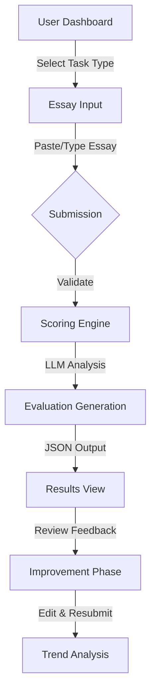

# User Journey Mapping: Essay Submission to Feedback Loop

This document outlines the core user flow for the IELTS Writing Scoring application, ensuring alignment with official IELTS rubrics (Task Response, Coherence & Cohesion, Lexical Resource, Grammatical Range & Accuracy) and supporting iterative improvement.

## 1. High-Level Flow

## 2. Detailed Steps

### Step 1: Task Selection & Input
- **User Action**: Selects IELTS Task 1 (Report/Letter) or Task 2 (Essay).
- **System Action**:
  - Loads specific constraints (e.g., word count min: 150 vs 250).
  - Presents question prompt input or random prompt generator.
  - **State**: `draft`

### Step 2: Submission & Pre-processing
- **User Action**: Clicks "Evaluate".
- **System Action**:
  - Validates word count.
  - Checks subscription status/credits.
  - Saves essay to `essays` table.
  - **State**: `submitted` -> `processing`

### Step 3: Four-Dimension Scoring (The "Black Box")
- **System Action**:
  - Sends payload to LLM with rubric-specific instructions.
  - **Task Response (TR)**: Analyzes topic coverage, position clarity, and idea development.
  - **Coherence & Cohesion (CC)**: Checks logical sequencing, paragraphing, and linking words.
  - **Lexical Resource (LR)**: Evaluates vocabulary range, precision, and collocation.
  - **Grammatical Range & Accuracy (GRA)**: Assesses sentence structures and error density.
  - **State**: `processing` -> `evaluated`

### Step 4: Results & Feedback Presentation
- **User Action**: Views the "Scorecard".
- **UI Components**:
  - **Overall Band Score**: (e.g., 6.5).
  - **Radar Chart**: Visualizing the 4 criteria.
  - **Detailed Breakdown**:
    - **Strengths**: What worked well (quoted from essay).
    - **Weaknesses**: Specific areas to fix (linked to rubric).
    - **Actionable Tips**: "Use more complex sentence structures in paragraph 2."
  - **Inline Corrections**: Highlighted sentences with suggested improvements.

### Step 5: The Feedback Loop (Iterative Improvement)
- **User Action**: Clicks "Improve & Retry".
- **System Action**:
  - Loads original essay into editor.
  - User modifies based on feedback.
  - Submits as a **new attempt** linked to the original essay ID.
  - **State**: `draft` (attempt #2)

### Step 6: Trend Analysis & Progress
- **User Action**: Views "History" or "Progress" tab.
- **System Action**:
  - Fetches all `attempts` for a user.
  - Calculates `delta_band` (Score improvement over time).
  - Generates `trend_comment` (e.g., "Your GRA score has improved by 0.5 bands in the last 3 essays.").

## 3. Edge Cases & Error Handling

- **LLM Failure**: If the scoring engine times out or returns malformed JSON.
  - **Fallback**: Queue for retry (max 3 times). Notify user "Analysis taking longer than expected."
- **Off-Topic Submission**:
  - **Detection**: LLM flags "irrelevant content".
  - **Action**: Return Band 0 with "Off-Topic" warning, do not deduct credits.
- **Plagiarism/AI Detection**: (Optional future feature) Flag potential non-original content.

## 4. Monetization Gates (Placeholder)

- **Free Tier**:
  - Limited to Overall Score only (no detailed breakdown).
  - 1 submission per day.
- **Pro Tier**:
  - Full 4-dimension breakdown.
  - Unlimited revisions (attempts).
  - Trend analysis history.

## 5. Summary Metrics
- **Total Steps**: 6 distinct stages.
- **Key Data Objects**: User, Essay, Evaluation, Attempt.
- **Critical Path**: Submission -> LLM Latency -> JSON Parse -> Render.
